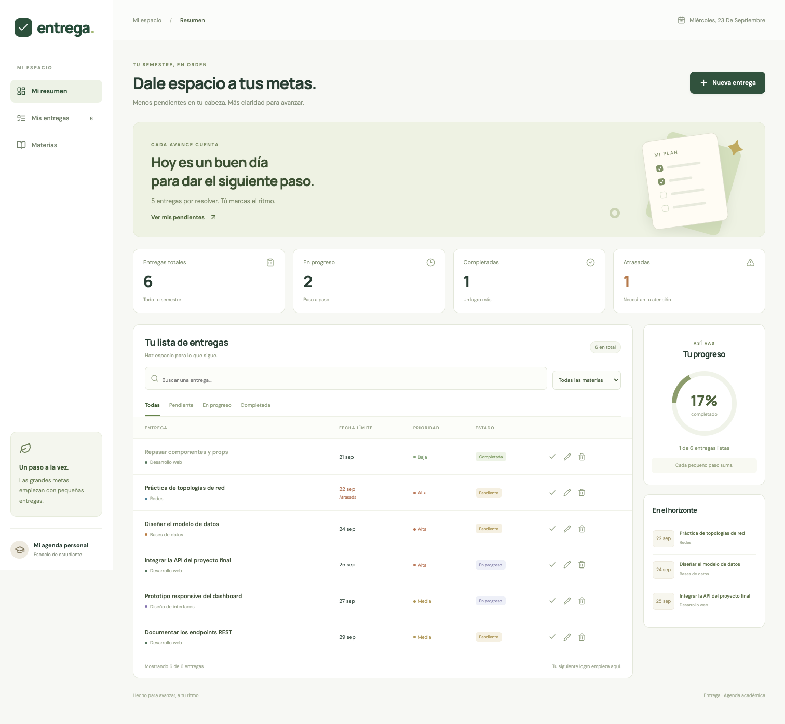
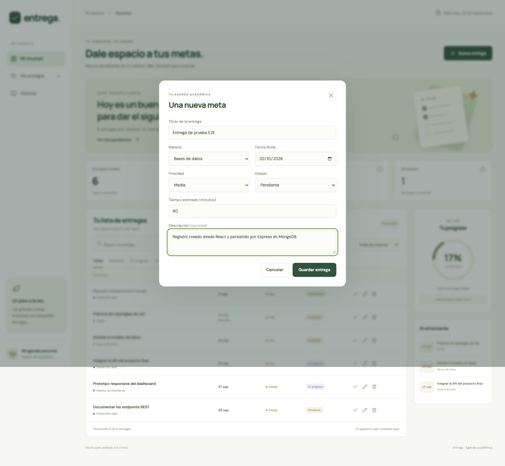
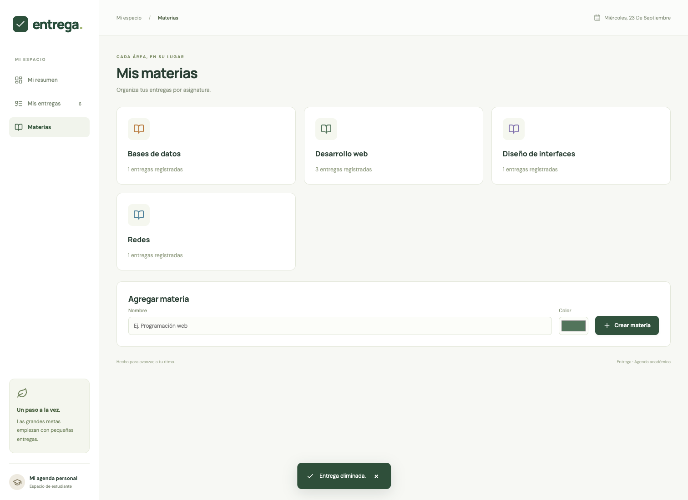
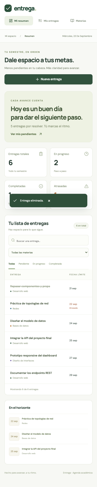

# Entrega · Examen Global

Aplicación full stack para organizar entregas académicas. React + Vite, Express + Node.js y MongoDB; tres servicios Docker Compose.

## Proyecto, problema y alcance

Los trabajos dispersos entre chats y apuntes dificultan seguir las fechas límite. Entrega permite a un estudiante registrar, priorizar y consultar sus trabajos en una agenda personal. Administra materias y entregas, con estados pendiente/en progreso/completada, tiempos estimados y fechas límite.

Usuarios: estudiantes. Objetivo: reducir olvidos y visualizar el avance del semestre. Alcance: uso personal local, sin autenticación ni sincronización entre cuentas. No incluye calificaciones, adjuntos ni notificaciones. Los datos se guardan en MongoDB; React nunca usa un arreglo fijo como fuente principal.

[Definición del proyecto](docs/definicion.md) · [Evidencias](docs/evidencias.md) · [Guion de defensa](docs/guion-video.md)

## Arquitectura

```text
Usuario -> React -> HTTP /api -> Express -> Mongoose -> MongoDB
Docker: navegador :8080 -> frontend Nginx :80 -> backend :5001 -> db :27017
```

Nginx y Vite hacen proxy de `/api`: el navegador usa el mismo origen y no necesita CORS. Los nombres `backend` y `db` son DNS internos de Compose. MongoDB no publica su puerto al host. Los puertos de la aplicación se enlazan a 127.0.0.1 porque esta versión está diseñada para uso local.

## Modelo de datos

- **Materia**: `_id` ObjectId, nombre String (1-60), clave normalizada única, color hexadecimal, createdAt/updatedAt Date.
- **Entrega**: `_id` ObjectId, título String (1-100), clave normalizada, descripción String (0-1000), materia ObjectId (referencia), fechaLimite String ISO `YYYY-MM-DD` validada, prioridad enum, estado enum, minutos Number entero (5-2400), createdAt/updatedAt Date.
- Relación: una materia tiene muchas entregas. El par materia + título normalizado es único. Las fechas se almacenan como día de calendario para evitar cambios por zona horaria. No se permite asignar una materia inexistente.

## Estructura

```text
client/       React, componentes, páginas, cliente HTTP, Dockerfile, Nginx
server/       Express, rutas, controladores, modelos, validaciones, pruebas
server/scripts/  Semilla y MongoDB local de desarrollo
scripts/      Verificación Docker y captura de evidencia de API
 docs/        Definición, capturas, pruebas y guion
output/       PDF y video de demostración
 docker-compose.yml
```

## Ejecución con Docker (recomendada)

Requisitos: Docker Engine o Docker Desktop funcionando y Docker Compose v2. Desde la raíz:

```bash
cp .env.example .env
docker compose up --build -d
docker compose ps
# Opcional: crea ejemplos sin reemplazar tus registros
docker compose exec backend node scripts/seed.js
```

Abre **http://localhost:8080**. API: **http://localhost:5001/api/health**. En una base vacía, crea una materia en la sección Materias y luego tu primera entrega.

```bash
docker compose up -d       # iniciar nuevamente
docker compose logs backend
docker compose down       # detener; conserva el volumen
```

El volumen `mongo_data` conserva los registros aunque se recreen los contenedores. No utilices `docker compose down -v` salvo que quieras borrar la base. Los healthchecks ordenan el arranque: db sana -> backend sano -> frontend.

### Verificación reproducible de contenedores y persistencia

```bash
bash scripts/verificar-docker.sh
```

Construye y levanta los servicios, captura `docker compose ps`, comprueba la API a través del frontend, crea un registro de prueba, ejecuta `down` y `up`, verifica que el registro sobreviva y lo elimina. Guarda los resultados en `docs/docker-verificacion.txt`. Necesita Node.js 20+ en el host para realizar las comprobaciones HTTP.

**Estado real de esta entrega:** los archivos Docker están implementados. Este entorno no tiene Docker instalado; por ello NO se ha ejecutado `docker compose up --build` ni se certifica el estado de los contenedores. La persistencia sí se probó reiniciando un proceso MongoDB real local. La validación Docker y su evidencia quedan pendientes de ejecutar el script en un equipo con Docker.

## Ejecución local sin Docker

Requisitos: Node.js 20.19+ o 22.12+ y npm. Instala dependencias:

```bash
npm install
npm run install:all
cp server/.env.example server/.env
```

Terminal 1, base de datos:

```bash
npm run db:local
```

Esta utilidad descarga y ejecuta un **mongod real** (no un mock) con motor WiredTiger. Conserva archivos en `server/.data/mongo`, ignorados por Git. Puerto 27019. También puedes usar tu MongoDB y cambiar `MONGODB_URI`.

Terminal 2, backend:

```bash
npm run seed --prefix server  # opcional
npm run dev:server
```

Terminal 3, frontend:

```bash
npm run dev:client
```

Abre **http://localhost:5176**. El servidor de desarrollo dirige `/api` a `127.0.0.1:5001`. Para producir archivos estáticos: `npm run build`; resultado en `client/dist`. En producción se sirven con el Nginx configurado.

## Variables de entorno

- Raíz `.env`: `WEB_PORT=8080`, `API_PORT=5001` (puertos Docker publicados).
- `server/.env`: `PORT=5001`, `MONGODB_URI=mongodb://127.0.0.1:27019/entrega` (desarrollo).
- `client/.env`: `VITE_API_URL=/api`, `API_PROXY_TARGET=http://127.0.0.1:5001` (opcional; valores predeterminados).
- Compose define `MONGODB_URI=mongodb://db:27017/entrega` dentro del backend.

Los `.env` están excluidos de Git; las plantillas `.env.example` no tienen secretos. No se requieren credenciales para la red local de esta demostración.

## API REST

- `GET /api/health`: salud de API y conexión MongoDB; 200 o 503.
- `GET /api/materias`: catálogo.
- `POST /api/materias`: crear nombre y color; 201.
- `GET /api/entregas`: todas las entregas con su materia.
- `GET /api/entregas/:id`: detalle; 200 o 404.
- `POST /api/entregas`: crear; 201.
- `PUT /api/entregas/:id`: reemplazar campos editables; 200.
- `DELETE /api/entregas/:id`: eliminar; 204.

Cuerpo de POST/PUT (reemplaza `materia` con un `_id` real del catálogo):

```json
{"titulo":"Documentar proyecto","descripcion":"Preparar README","materia":"ID_REAL_DE_MATERIA","fechaLimite":"2026-10-20","prioridad":"alta","estado":"pendiente","minutos":60}
```

400: datos o identificador inválidos; 404: recurso inexistente; 409: duplicado; 413: cuerpo demasiado grande; 503: servicio de datos no disponible. Errores JSON: `{ "message": "Explicación legible" }`. Las solicitudes tienen límite de 32 KB; las consultas se validan antes de llegar a MongoDB.

## Pruebas y evidencias

```bash
npm test
npm run build
```

Las 8 pruebas de integración usan HTTP y un proceso MongoDB aislado: CRUD, errores, duplicados, validación, y persistencia después de detener/reabrir la base. No modifican la base de demostración. Resultados: [pruebas API](docs/pruebas-api.txt), [pruebas de navegador](docs/pruebas-navegador.txt).

### Vista principal


### Formulario conectado a la API


### Materias


### Móvil


## Git y defensa

Los commits registran definición, backend, frontend, contenedores/pruebas y documentación. El historial corresponde al desarrollo real. El video técnico local no reemplaza la defensa oral del estudiante ni la ejecución pendiente de Docker; usa el guion para completar esa parte.

## Regenerar los entregables

- PDF: instala `reportlab` y ejecuta `python3 scripts/generar-pdf.py`. El script usa las capturas y JSON de `docs`. Edita los datos de portada en el script antes de generar la versión personalizada.
- Video: con los servicios locales activos, ejecuta `npm install`, `npx playwright install ffmpeg` y `node scripts/grabar-demo.cjs`. Requiere Google Chrome. La grabación crea y elimina un registro de demostración.
- Prueba de navegador: `npm run test:e2e` con MongoDB, API y Vite activos; guarda capturas y elimina solo los registros de prueba.

La grabación local dura aproximadamente 1 minuto 13 segundos, sin narración. La defensa oral y el segmento Docker se completan siguiendo el guion.
